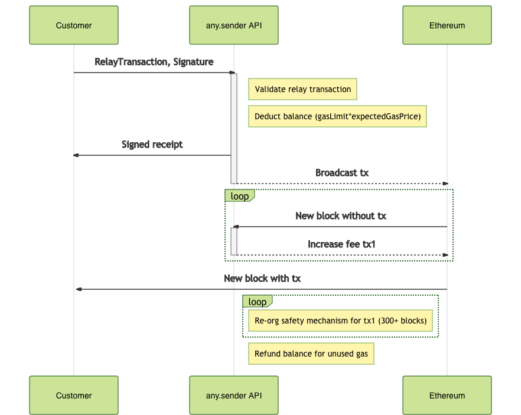
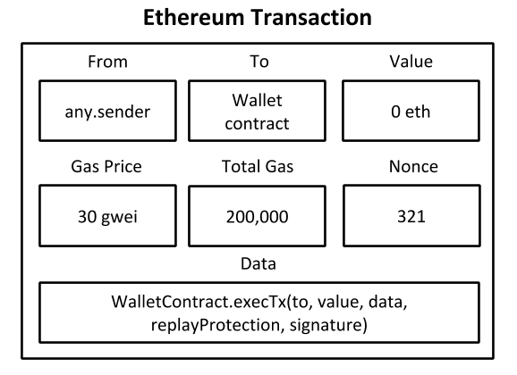

# Overview of any.sender internals

any.sender has three core components:

- **Payment Gateway**: Tracks latest balance for the user,
- **Relayer**: Manages a queue of transactions ordered by fee (high to low),
- **Block cache**: Tracks the blockchain and transactions confirmed locally.

**Payment gateway.** Our gateway keeps track of the user's latest balance via on-chain accounting. The initial balance for the user requires an on-chain deposit into our Relay contract and it is associated with the `recipient` address after a number of confirmations. All relay transactions sent to the any.sender service must be signed by the recipient's address and every Ethereum transaction sent by our service has a subtle anchor that links it to the `recipient`. This lets us keep track of all deposits and coins spent by just processing the on-chain accounting.

**Relayer.** A relayer is responsible for managing a queue of transactions that are ordered by fee (high to low). Every new transaction is appended to the end of the queue and the start of the queue has priority when broadcasting. When a new block is mined, the relayer computes the list of _pending transactions_ and then evaluates each pending transaction according to a fee schedule. This fee schedule takes into account any new estimates for the base fee and the length of time (in blocks) the transaction has been _pending_. If a pending transaction's fee has increased by 13% (parity nodes require 12.5% bump and geth requires 10% bump) since the last time it was published, then our relayer will re-broadcast it.

**Block cache.** We keep track of the latest N blocks in the blockchain and we associate a list of pending & confirmed relay transactions from our relayers for each block. This provides a performance benefit as we can verify ground-truth data locally and it helps the relayer handle forks (re-org protection) as it can verify whether a forked block has dropped a previously confirmed relay transaction and thus the relayer must broadcast it. Note it tracks the relay transaction and not the Ethereum transaction, so the relayer can always verify the relay transaction was confirmed.

## Redundant any.sender instances

We run a single payment gateway and up to 3 instances of any.sender.

> An instance of any.sender includes three relayers and a block cache.

The primary any.sender instance is responsible for handling all transactions immediately. The other any.senders instances only activate if a relay transaction has not been mined for at least X blocks (e.g. 50 blocks). The redundancy is necessary in the event there is an unexpected problem with the primary relayer. If two instances mine the same relay transaction, then the customer is only charged once.

## Sending a transaction to the API

Before the customer can send a relay transaction to any.sender, they must have a positive balance on the service. Please check out [Payments](payments.md) for more information.

<p align="center">
  
</p>

The customer must prepare a relay transaction that is compatible with the any.sender service and more information can be found at [Relay Transaction](relayTransaction.md).

A relay transaction includes:

- `to` address of target contract,
- `data` which is the function/arguments to execute in the target contract,
- `gasLimit` the total gas the customer is willing to purchase.

The `recipient` address with a positive balance on any.sender must sign the relay transaction and send it to the any.sender API.

**Accepting the relay transaction**. any.sender validates the relay transaction (e.g. chainid, signature, schema) to verify it can broadcast the transaction to Ethereum.
Then, the relay transaction is passed to the payment gateway and the user's balance is deducted according to `lockedBalance = gasLimit*expectedGasPrice`.
The `lockedBalance` is the maximum that any.sender will charge for the relay transaction and the `expectedGasPrice` includes an estimate based on current network conditions and an overhead to take into account future fee bumps.
Assuming the relay transaction was validated and the balance was locked successfully, then any.sender returns a signed receipt to the customer. More information about the [Relay Receipt](relayReceipt.md).

**Sending to Ethereum**.
It is now up to any.sender to get the relay transaction accepted into the Ethereum blockchain. Behind the scenes, any.sender passes the relay transaction to the backup instances and to one relayer. This relayer estimates the initial base fee based on current network conditions, appends to the end of the transaction queue, packs into an Ethereum transaction and broadcasts it to the Ethereum network. It republishes the transaction nearly every other block until it is mined and then monitors the blockchain for re-org protection.

When the transaction is confirmed, and we are certain it is confirmed, the user is refunded any funds not spent from `LockedBalance`. Essentially, the refunded amount is `refundBalance = lockedBalance - (gasPrice*gasUsed) + fee`. We have opted for off-chain accounting as it involves no gas overhead, but the full balance can be re-computed using on-chain data.

## Wallet contract interaction

We provide an overview for how any.sender interacts with your wallet contract and the target smart contract. This section only considers **direct transactions**.

<p align="center">
  
</p>

any.sender takes the relay transaction and packs it into an Ethereum transaction. The `from` address of the transaction is one of any.sender's relay keys, but the `to`, `data` and `gasLimit` is set by the customer.

<p align="center">
  
</p>

We recommend that all relay transactions are sent via the customer's wallet contract. This ensures `msg.sender` for the target contract is the wallet contract's address. Otherwise, if the Ethereum transaction executes the target contract directly, then the any.sender relayer is set as msg.sender. More discussion around the [msg.sender problem](https://ethresear.ch/t/native-meta-transaction-proposal-roundup/7525). Thankfully, the overhead of using a wallet contract is approximately 26k gas per transaction.

Wallet contracts can hold the users funds (even before it is deployed) and send ERC 20 / ETH. They support more exotic replay protection to support concurrent (and out-of-order) transactions for easier nonce management and batching several transactions into one (e.g. take flash loan, swap on uniswap, replay flash loan, atomically). To execute the target contract, it simply needs to `CALL` into the target address with the supplied data.

Check out our [client](./client) tooling for more information. It includes our recomended wallet contracts and it takes care of all replay protection/crafting the relay transaction/interacting with any.sender. As a developer, all you need to do is the following:

```js
const echo = new Contract(echoContractAddress, echoAbi, connectedUser);
const anyEcho = any.sender(echo);
const relayReceipt = await anyEcho.functions.echo("echo to the world");
const transactionReceipt = await relayReceipt.wait();
```
